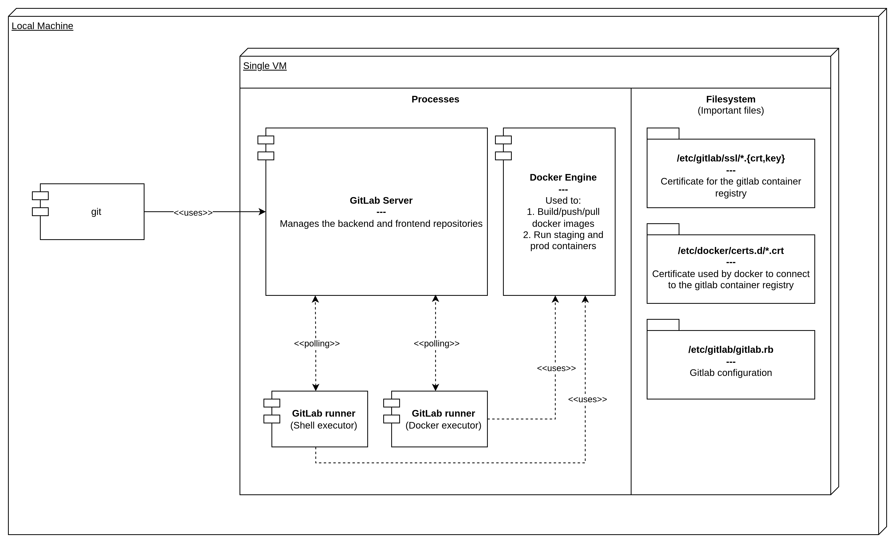
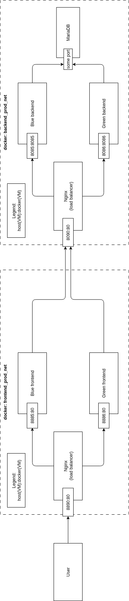

# devops-e4l

Final project for the DevOps course at Uni.lu.


## Diagrams

*Figure: System architecture*


*Figure: Docker networks used for the blue green deployment strategy*


## Assumptions/Pre-requisites

### Software
1. Ansible (v 2.16.3, or higher)
- Instructions to install here: https://docs.ansible.com/
- Make sure to have ansible-vault installed
2. VirtualBox(v 7.0, or higher)
- Instructions to install here: https://www.virtualbox.org/wiki/Downloads
3. Vagrant (v 2.4.9, or higher)
- Instructions to install here: https://www.vagrantup.com/downloads.html

### Ansible vault
The project uses Ansible Vault to securely store sensitive information (GitLab credentials of the demo user, CI/CD variables, etc.).

**Vault password:** `devops2026`

**To view vault contents:**
```bash
ansible-vault view <git_root_folder>/VM/playbook/group_vars/vault.yml
```

**To edit vault contents:**
```bash
ansible-vault edit <git_root_folder>/VM/playbook/group_vars/vault.yml
```

**Notes**: While the vault can be edited using the previous command, modifying these values may break the provisioning process or the CI/CD pipeline. To ensure a successful demo, it is recommended to keep the existing configuration unchanged.

## Create DevOps environment (fully automated)

The following commands are used to create and provision the VM by doing all the steps needed to have a fully functional GitLab instance with the projects, runners, and CI/CD variables configured.

The following command asks for a password to proceed, this password is needed by ansible to access the vault.

```bash
cd <git_root_folder>/VM
# password: devops2026
vagrant up --provision-with "fully_automated"
```

**Notes**
- The VM is automatically provisioned using Ansible playbooks.
- These playbooks do the following things:
    - Install Docker
    - Install Gitlab
    - Generate a certificate for the gitlab container registry
    - Enable gitlab container registry
    - Copy certificate to a specific folder enabling docker to login into the container registry
    - Install gitlab-runner
    - Create a GitLab user account
    - Generate personal access tokens (root and user)
    - Create backend and frontend GitLab projects
    - Push local repositories to GitLab
    - Configure CI/CD environment variables for both projects
    - Create and register GitLab runners (docker and shell runners for both projects)
    - Revoke generated tokens for security reasons

If these step succeeded, you can **skip** the next one and go directly to the `Scenarios` paragraph.

## Create DevOps environment (Partially automated - optional)

These "partially automated" steps are provided as a fallback in case the fully automated provisioning fails, or as an alternative method for setting up the DevOps environment.

In order:

### 0. Remove previously created VMs
If the fully automated provisioning failed, it is needed to remove the previously created VM by using the following commands:
```bash
cd <git_root_folder>/VM
vagrant halt
vagrant destroy
rm -rf .vagrant
```

### 1. Create VM
```bash
vagrant up --provision-with "partially_automated"
```

**Notes**
- The VM is automatically provisioned using Ansible playbooks.
- These playbooks do the following things:
    - Install Docker
    - Install Gitlab
    - Generate a certificate for the gitlab container registry
    - Enable gitlab container registry
    - Copy certificate to a specific folder enabling docker to login into the container registry
    - Install gitlab-runner

### 2. Change root password
```bash
cd <git_root_folder>/VM
vagrant ssh
sudo gitlab-rake "gitlab:password:reset"
# username: root
# password: <your_root_password>
```

### 3. Create a Gitlab user
Go to `http://192.168.56.9/gitlab` in your browser and follow the guided rules to create a new user.

To simplify the next steps, insert the following information for the user:

- username: `e4lowner`
- email: `owner@owner.com`
- password: `Verystrongpassword2026`

`First name` and `Last name` can be freely chosen.

### 4. Accept new user through root
Login to Gitlab using the root credentials, accept the newly created user, logut and login with this new user credentials.

**TODO:** Maybe more specific here? 

### 5. Create repositories on GitLab

**TODO:** Make the instructions independent from the specific ip address used for the VM

#### Backend

1. Create a new empty project:
   - Click **New project** -> **Create blank project**
   - Use `lu.uni.e4l.platform.api.dev` as the Project name
   - Set `public` for the Visibility level
   - **Do NOT** initialize the repository with a README, `.gitignore`, or license
   - Create the project

2. From your local machine, push the existing backend project to GitLab:
    ```bash
    cd <git_root_folder>/lu.uni.e4l.platform.api.dev

    # Make sure that any previously created git folder is removed
    rm -rf .git/

    git init
    git config --local user.name "e4lowner"
    git config --local user.email "owner@owner.com"
    git branch -M main
    git remote add origin http://192.168.56.9/gitlab/e4lowner/lu.uni.e4l.platform.api.dev.git
    git add .
    git commit -m "Initial backend commit"
    git push -u origin main -o ci.skip # This skips the pipeline automatically
    ```

#### Frontend

1. Create a new empty project:
   - Click **New project** -> **Create blank project**
   - Use `lu.uni.e4l.platform.frontend.dev` as the Project name
   - Set `public` for the Visibility level
   - **Do NOT** initialize the repository with a README, `.gitignore`, or license
   - Create the project

2. From your local machine, push the existing backend project to GitLab:
    ```bash
    cd <git_root_folder>/lu.uni.e4l.platform.frontend.dev

    # Make sure that any previously created git folder is removed
    rm -rf .git/

    git init
    git config --local user.name "e4lowner"
    git config --local user.email "owner@owner.com"
    git branch -M main
    git remote add origin http://192.168.56.9/gitlab/e4lowner/lu.uni.e4l.platform.frontend.dev.git
    git add .
    git commit -m "Initial frontend commit"
    git push -u origin main -o ci.skip # This skips the pipeline automatically
    ```

### 6. Set CI/CD env variables

Access the vault in order to see the CI/CD variables:
```bash
# password: devops2026
ansible-vault view <git_root_folder>/VM/playbook/group_vars/vault.yml
```

#### Backend

Go to the **Backend** project on gitlab, then `Settings -> CI/CD -> Variables -> Add Variable` and create all the backend variables (`backend_cicd_variables` in the vault).

Ensure variables marked as `masked: true` in the vault are masked in the UI, otherwise, keep them visible. Maintain all other default settings.

#### Frontend

Go to the **Frontend** project on gitlab, then `Settings -> CI/CD -> Variables -> Add Variable` and create all frontend variables (`frontend_cicd_variables` in the vault).

Ensure variables marked as `masked: true` in the vault are masked in the UI, otherwise, keep them visible. Maintain all other default settings.

### 7. Create docker and shell runners


#### Precondition 1: Generate a personal access token

Follow this guide here: `https://docs.gitlab.com/user/profile/personal_access_tokens/#create-a-personal-access-token`

**Notes:**
- Select just the `api` scope
- Keep track of this token (you can access it only once).

#### Precondition 2: Get project ids of both repositories

Follow this guide here: `https://docs.gitlab.com/user/project/working_with_projects/#find-the-project-id`

---

Execute the following commands one after the other.

```bash
cd <git_root_folder>/VM
vagrant ssh

# Create shell variables to simplify the process
PROJECT_ID_BACKEND=<project_id_backend>
PROJECT_ID_FRONTEND=<project_id_frontend>
GITLAB_TOKEN=<gitlab_token>

#################### BACKEND ####################
# DOCKER RUNNER
curl --silent --request POST --url "http://192.168.56.9/gitlab/api/v4/user/runners" \
  --data "runner_type=project_type" \
  --data "project_id=$PROJECT_ID_BACKEND" \
  --data "description=[VM] docker" \
  --data "tag_list=docker-runner" \
  --header "PRIVATE-TOKEN: $GITLAB_TOKEN"

# Copy the <runner_token> token that the command 
#  returns and use it in the following command

sudo gitlab-runner register \
  --non-interactive \
  --url "http://192.168.56.9/gitlab/" \
  --token "<runner_token>" \
  --executor "docker" \
  --docker-image "alpine:latest" \
  --docker-privileged \
  --docker-volumes "/etc/docker/certs.d:/etc/docker/certs.d:ro"

# SHELL RUNNER
curl --silent --request POST --url "http://192.168.56.9/gitlab/api/v4/user/runners" \
  --data "runner_type=project_type" \
  --data "project_id=$PROJECT_ID_BACKEND" \
  --data "description=[VM] shell" \
  --data "tag_list=shell-runner" \
  --header "PRIVATE-TOKEN: $GITLAB_TOKEN"

# Copy the <runner_token> token that the command 
#  returns and use it in the following command

sudo gitlab-runner register \
  --non-interactive \
  --url "http://192.168.56.9/gitlab/" \
  --token "<runner_token>" \
  --executor "shell" \
  --docker-image "alpine:latest"

#################################################

################### FRONTEND ####################
# DOCKER RUNNER
curl --silent --request POST --url "http://192.168.56.9/gitlab/api/v4/user/runners" \
  --data "runner_type=project_type" \
  --data "project_id=$PROJECT_ID_FRONTEND" \
  --data "description=[VM] docker" \
  --data "tag_list=docker-runner" \
  --header "PRIVATE-TOKEN: $GITLAB_TOKEN"

# Copy the <runner_token> token that the command 
#  returns and use it in the following command

sudo gitlab-runner register \
  --non-interactive \
  --url "http://192.168.56.9/gitlab/" \
  --token "<runner_token>" \
  --executor "docker" \
  --docker-image "alpine:latest" \
  --docker-privileged \
  --docker-volumes "/etc/docker/certs.d:/etc/docker/certs.d:ro"

# SHELL RUNNER
curl --silent --request POST --url "http://192.168.56.9/gitlab/api/v4/user/runners" \
  --data "runner_type=project_type" \
  --data "project_id=$PROJECT_ID_FRONTEND" \
  --data "description=[VM] shell" \
  --data "tag_list=shell-runner" \
  --header "PRIVATE-TOKEN: $GITLAB_TOKEN"

# Copy the <runner_token> token that the command 
#  returns and use it in the following command

sudo gitlab-runner register \
  --non-interactive \
  --url "http://192.168.56.9/gitlab/" \
  --token "<runner_token>" \
  --executor "shell" \
  --docker-image "alpine:latest"

# Restart the runner (IMPORTANT)
sudo gitlab-runner restart
```

## Scenarios (TO COMPLETE)
The commit and staging stages are fully automated while the production stage is manual.

### Precondition:
Clone both repositories from gitlab on your local machine, then configure both of them with the commands:
```bash
git config --local user.name "e4lowner"
git config --local user.email "owner@owner.com"
```
**Note:** Using the repositories in this folder is possible but not suggested, as the primary approach above offers a much simpler  configuration.

---

Perform the following tests:

### 1. Backend

1. Modify something in the cloned repository and push it to Gitlab (username: `e4lowner`, password: `Verystrongpassword2026`).
2. Verify that the commit and staging stages complete without problems (assuming that no bugs were introduced in the first place)
3. Check the container registry and see if the image has been pushed
4. Access the staging backend on `http://localhost:8084/e4lapi/questionnaire` from your browser (a json page should be returned)
    - Verify that the deployment is visible in the `Operate -> Environments` page
5. Run the manual `promote_image` and `deploy_production` jobs in the `production` stage from the pipeline view on Gitlab
    - Access the blue/green production environments on `http://localhost:8085/e4lapi/questionnaire` and `http://localhost:8086/e4lapi/questionnaire` (the same json page should be returned)
6. Run the `release` job in the `production` stage
    - Access the released API on `http://localhost:8090/e4lapi/questionnaire` (the same json page should be returned)
    - Verify that the deployment is visible in the `Operate -> Environments` page
7. Run the `rollback` job in the `production` stage
    - Access the rolled-back API on `http://localhost:8090/e4lapi/questionnaire` (the same json page should be returned)
    - Verify that the deployment is visible in the `Operate -> Environments` page

### 2. Frontend

1. Modify something in the cloned repository and push it to Gitlab (username: `e4lowner`, password: `Verystrongpassword2026`).
2. Verify that the commit and staging stages complete without problems (assuming that no bugs were introduced in the first place)
3. Check the container registry and see if the image has been pushed
4. Access the staging frontend on `http://localhost:8884/` from your browser
    - Verify that the quiz can be accessed (kid or adult quiz + check that the quiz can be actually performed but no need to complete it)
    - Verify that the deployment is visible in the `Operate -> Environments` page
5. Run the manual `promote_image` and `deploy_production` jobs in the `production` stage from the pipeline view on Gitlab
    - Access the blue/green production environments on `http://localhost:8885/` and `http://localhost:8886/`
    - Verify that the quiz can be accessed on both the environments (kid or adult quiz + check that the quiz can be actually performed but no need to complete it)
6. Run the `release` job in the `production` stage
    - Access the released website on `http://localhost:8890/`
    - Verify that the quiz can be accessed on both the environments (kid or adult quiz + check that the quiz can be actually performed but no need to complete it)
    - Verify that the deployment is visible in the `Operate -> Environments` page
7. Run the `rollback` job in the `production` stage
    - Access the rolled-back website on `http://localhost:8890/`
    - Verify that the quiz can be accessed on both the environments (kid or adult quiz + check that the quiz can be actually performed but no need to complete it)
    - Verify that the deployment is visible in the `Operate -> Environments` page

## Troubleshooting

### VirtualBox fails to start the VM

If `vagrant up` fails with an error indicating that VT-x/AMD-V is already in use, another hypervisor is active on the host system (e.g. KVM on Linux or Hyper-V/WSL2 on Windows).

This project uses :contentReference[oaicite:0]{index=0} as the Vagrant provider, which requires exclusive access to hardware virtualization.

**Possible solution:** stop or disable the conflicting hypervisor.

**Example (Linux hosts):** temporarily unload KVM kernel modules.
```bash
sudo modprobe -r kvm_intel kvm_amd kvm
```

**Remark:** this is a host configuration issue and not related to the project itself.
